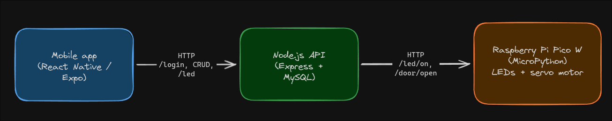

# Casa Automática — Smart Home Scale Model

> **College project (FIB — Embedded Systems / "Sistemas Embarcados").**
> Built together with the **Architecture class**, which designed and assembled
> the physical scale model of the house. Our group handled all of the embedded
> automation and software: the microcontroller firmware, the backend API and
> the mobile app that controls the model.

**Casa Automática** ("Automatic House") is an end-to-end home-automation demo
running on a physical architectural maquette. A **Raspberry Pi Pico W** drives
the lights (LEDs) and a curtain/door servo motor inside the model. A
**Node.js + MySQL** API manages the data and relays commands to the hardware,
and a **React Native (Expo)** mobile app lets you log in and control everything
from a phone.

---

## How it works



1. The user logs into the app and opens the control screen.
2. The app calls the Node.js API (authentication, CRUD, device control).
3. For physical devices, the API forwards a simple HTTP command to the Pico W.
4. The Pico W switches the LED on/off and rotates the servo to open/close the
   curtain (door), reporting its state back as JSON.

---

## Repository structure

| Path | What it is |
| --- | --- |
| `Raspberry/main.py` | MicroPython firmware for the Raspberry Pi Pico W. Connects to Wi-Fi and exposes a tiny HTTP server that controls the LED (GP0) and the servo motor (GP15). |
| `App/` | React Native (Expo) mobile app + the Node.js backend. |
| `App/server/` | Node.js API (`server.js`) and MySQL setup/seed (`db.js`). |
| `App/src/` | Mobile app source (screens, navigation, API client, offline mode, theme). |
| `SE RELATÓRIO TÉCNICO _FINAL by Yuuki Kamiya.pdf` | Original technical report delivered for the course. |

---

## Hardware (bill of materials)

| Qty | Component | Role |
| --- | --- | --- |
| 1 | Raspberry Pi Pico W | Runs the automation firmware and HTTP server |
| 1 | Servo motor SG90 (9g) | Opens / closes the curtain (door) |
| 7 | White & yellow LEDs | Simulate the house lamps |
| 1 | Breadboard | Wiring the Pico circuit |
| ~24 | Jumper wires | Connect LEDs and motor on the breadboard |
| 3 | Resistors | Limit current to the LEDs |

**Pin map:** LED on `GP0`, servo on `GP15` (PWM @ 50 Hz).

---

## Software stack

- **Firmware:** MicroPython on the Raspberry Pi Pico W (`Raspberry/main.py`)
- **Backend:** Node.js, Express, MySQL (`mysql2`), CORS
- **App:** React Native 0.81 + Expo 54, TypeScript, React Navigation
- **Database:** MySQL (`casa_inteligente`) — auto-created and seeded on first run

### Backend API endpoints

- `POST /login` — authentication
- `GET/POST/PUT/DELETE /usuarios` · `/clientes` · `/casas` · `/dispositivos` — full CRUD for the four entities
- `POST /dispositivos/:id/led` — updates the device status in MySQL **and** forwards `led/on` / `led/off` to the Pico W

### Firmware HTTP routes (on the Pico W)

- `GET /led/on` · `GET /led/off` — toggle the LED
- `GET /door/open` · `GET /door/close` — move the servo (curtain/door)
- Every response returns the current state as JSON, e.g. `{"led":"on","door":"closed"}`

---

## Running it

> Prerequisites: Node.js, MySQL (XAMPP/WAMP works out of the box), and the
> Expo CLI / Expo Go app on your phone.

### 1. Flash the Pico W

Edit the Wi-Fi credentials at the top of `Raspberry/main.py` (`SSID` /
`PASSWORD`), then copy the file onto the Pico W as `main.py` (e.g. with Thonny).
On boot it connects to Wi-Fi and prints its IP — note it for the next step.

### 2. Start the backend

```bash
cd App/server
npm install
# optional: configure DB/hardware via env vars
#   DB_USER, DB_PASSWORD, DB_HOST, DB_PORT, DB_NAME, PICO_IP
PICO_IP=<your-pico-ip> npm start
```

The database, tables and seed data are created automatically on first launch.
Seeded login: **admin@casa.com** / **123456**.

### 3. Start the mobile app

```bash
cd App
npm install
npm start   # then scan the QR code with Expo Go
```

Set `App/src/config.ts` → `API_URL` to your computer's LAN IP (not
`localhost`), e.g. `http://192.168.0.10:3000`, so the phone can reach the API.

> The app includes an **offline mode**: if the API/database is unreachable it
> falls back to local demo data and shows a banner.

---

## Project phases (as delivered)

1. Followed the maquette creation and brainstormed automation ideas with the architecture group.
2. Reviewed the finished model and split the work among the team.
3. Started programming the systems — lighting and curtain automation.
4. Bench-tested the LED circuit and began the curtain motor code.
5. Finished the full LED system.
6. Implemented the curtain system together with the app.
7. Full system review for the final presentation.

---

## Team — Equipe 4 (FIB, Embedded Systems)

| Name | RA | LinkedIn |
| --- | --- | --- |
| Felipe Inácio de Paula | 52772 | [lipeinacio](https://www.linkedin.com/in/lipeinacio) |
| Matheus Yuuki Okida Kamiya | 52418 | [yuuki-kamiya](https://www.linkedin.com/in/yuuki-kamiya-b67941363/) |
| Reuel Vitor Lanzetti | 52668 | [reuel-vitor-lanzetti](https://www.linkedin.com/in/reuel-vitor-lanzetti-1b106b269/) |
| Rogério Tiritan Marcone | 52168 | [rogério-tirtan-marcone](https://www.linkedin.com/in/rogério-tirtan-marcone-a55229353/) |
| Vinicius Silveira Campos | 52725 | [vinicius-silveira-campos](https://www.linkedin.com/in/vinicius-silveira-campos/) |

**Project post on LinkedIn:**
[See the publication](https://www.linkedin.com/posts/yuuki-kamiya-b67941363_fibbauru-cienciadacomputacao-activity-7468004249709244416-VFUA)

**Demo videos:** [Video 1](https://youtu.be/RN3cMxDrScA) · [Video 2](https://youtu.be/gFHqYLjHrPM)

---

## License

Released under the **MIT License** — free for anyone to use, study, modify and
share. See [`LICENSE`](LICENSE) for the full text.
